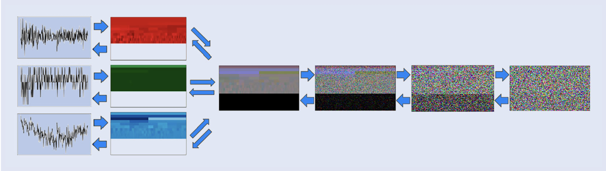
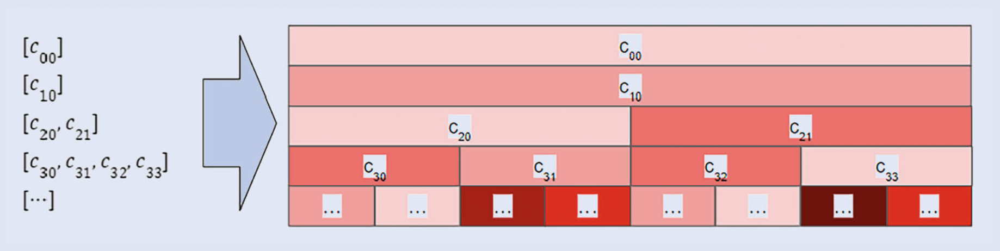
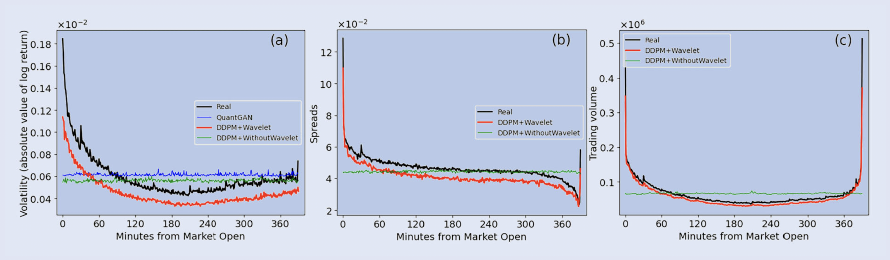

<!-- 
footer: 'UC SANTA BARBARA'
-->

# Generation of Synthetic Financial Time Series by Diffusion Models
## Authors: Takahashi & Mizuno (2025)
## Aarti Garaye 

March 10, 2026

---
# Overview & Introduction
## Background
Generating realistic synthetic financial time series is challenging due to statistical properties known as stylized facts
- Fat tails
- Volatility clustering (Slow decaying ACF aka. long memory)
- Seasonality Patterns
- Cross Correlation 

**Takahashi & Mizuno** propose using diffusion models to generate synthetic time series using Wavelet Transformation.
Time Series $\xrightarrow{W}$ Images $\longrightarrow$ DDPM $\longrightarrow$ New Images $\xrightarrow{W^{-1}}$ Synthetic Time Series

---

# Previous Works

Machine-Learning generative models like GANs, or VAEs have shown promise in generating realistic samples that capture many (but not all) stylized facts. 1

GANs has two neural network structure: a generator and a discriminator 
- Fails to capture extremes (crashes, high impact events, etc)
- Offers quality and speed benefits

VAEs has an encoder and decoder 
- Often produces smooth trajectories (underestimating extremes)
- Offers strength in diversity and speed

---

# Why Wavelet?
Key insight is to represent financial time series as images converting each day’s (or interval’s) price returns, spreads, and trading volumes into a single color image 
- Captures time and frequency. 
- Decomposes one-dimensional time series data into two-dimensional pictures in space and time

**Goal:** Leverage DDPM to generate high quality images which can be inverse transformed into synthetic time series data

---
# Brief Overview of DDPM
Denoising Diffusion Probabilistic Models (DDPMs) utilize a forward and reverse diffusion process to generate high-quality samples 
DDPMs operate based on a two-step Markovian process:
- Forward process (aka the diffusion process)
- Reverse process (aka the denoising process)

Given a data sample $x_0 \sim q(x),$ a predefined noise schedule $\beta_1, ... , \beta_T$ is employed to progressively corrupt the sample by adding Gaussian noise over $T$ steps. 

---
# DDPM2
The process is defined as
$$q(x_t | x_{t-1}) = \mathcal{N}(x_t; \sqrt{1-\beta_t}x_{t-1},\beta_tI)$$ 
Applying the reparametrization trick, the noisy sample $x_t$ at any time step $t$ can be explicitly computed as
$$
x_t = \sqrt{\bar{\alpha_t}}x_0 + \sqrt{1-\bar{\alpha}}\epsilon,
$$
where $\alpha_t = 1-\beta_t,\  \bar{\alpha_t} = \prod_{s=1}^t \alpha_s$, and $\epsilon \sim \mathcal{N}(0,I)$. The denoising process aims to iteratively recover the clean sample $x_0$ It is parameterized by a deep neural network $p_\theta$ 
$$
p_\theta(x_{t-1}|x_t) = \mathcal{N}(x_{t-1}; \mu_\theta(x_t,t), \Sigma_\theta(x_t,t))
$$

---
# DDPM
In practice, the model is trained to predict the noise $\epsilon$ added at each step by minimizing 
$$
\mathcal{L}(\theta) = \mathbb{E}_{x_0, \epsilon, t}\left[\| \epsilon - \epsilon_{\theta}(x_t,t) \|^2 \right]
$$

Overview of the methodology. (Left to right) Convert the time series of log returns (top), spreads (middle), and trading
volumes (bottom) into individual sets of wavelet coefficients, which are then mapped to color channels (RGB). The forward diffusion process
progressively corrupts a real image with noise over multiple steps. (Right to left) The reverse diffusion process (i.e. the DDPM’s learned
denoising) iteratively recovers a synthetic image from pure noise. Finally apply an inverse wavelet transform to the generated images to obtain the synthetic time series.

---
# Preprocessing
- **Mirror Expansion:** To use the Wavelet Transformation, the data must be of size $2^n$. 
- **Log Returns:** Differences of natural log of consecutive stock prices
- ***arsinh*:** Applied to trading volumes to approximate logarithmic scale3
- **Power Transformation:** To normalize $\frac{\left(X_t -\mu(X_t) \right)^\frac{1}{p}}{\sigma(X_t)}$
  - The power index can be different for each dimension in multivariate time series
- **Winsorization:** Substitute outliers. If $X_t > z \ (\text{resp.} X_t < z)$ then $X_t$ is replaced by $z$.  

---

# Pixels of Images
Employ the **Haar** wavelet as the mother wavelet to the preprocessed $X_t$. This gives us a sequence of **wavelet coefficients**
  - Why Haar? It's the simplest mother wavelet that provides a lossless transformation

The $2^n$ is important because then we obtain a zero-th order coefficient, a first order coefficient, two second order coefficients, four third order coefficients, and so on up to $(n- 1)$th order coefficients.

The coefficients are regarded as "how bright?" (luminance)  

---
# Building the Images

The pixels are filled as $k$th order coefficients are embedded in the $k$th row of pixels. When the size of the coefficients of each order is $2^l$ , the row of pixels is split into $2^l$ areas, each of which is filled with the same coefficient value

This conversion from three time series data (price log returns, spreads, and trading volumes, each with it's own color channel) in one interval to a single color image is applied to multiple intervals, resulting in multiple color images as the training dataset. 

---
# Model Setup
DDPMs utilize a UNet architecture to facilitate learning through convolutional processes.

This UNet is composed of multi-stage convolutions that include an attention mechanism. 
  - Employed the identical channel dimension parameters as found in the Hugging Face tutorial on DDPMs

---
# Experiment Dataset
- Minute based stock prices, spreads, and trading volumes of AAPL.O traded on NASDAQ from January 2005 to December 2014
- Minutes without trades are omitted
- 2481 sample days
- Business day opens at 9:30 and closes at 16:00 EST, so 390 minutes within each trading day
  - $390 \neq 2^n$ so after preprocessing the length of the time series becomes $512$
- Three time series (price log returns, the spreads, and the trading volumes) become $16 \times 256$ images with three channels in one day.
- $p = 1.5$ for log returns and $p=1$ for the rest
- $10\sigma$ as the winsorization level

---
# Training
- 100 epochs
- Other parameters following the HuggingFace tutorial for DDPM
- **Computational Time:** two hours for training under the above settings and another two hours to generate 2500 images on an NVIDIA GeForce RTX 4090 using the PyTorch framework.
- Comparing results against TimeGAN4, and QuantGAN5 
- Compares fat-tailed, long memory, U-shaped intraday pattern. Also the cross-correlation among the series

---
# Evaluation
Figures show superiority of this method in mirroring the real world fat-tailed distribution. 

This approach explains both the fast decay of autocorrelations in the log returns and the positive autocorrelations with the slow decay in volatilities

Intraday seasonality as average of per-minute time series over samples. (a) volatilities, absolute value of log return, (b) spreads,
and (c) trading volume. In each chart, black chart represents real data, blue chart represents QuantGAN, red chart represents DDPM with
wavelet imaging, and green chart represents DDPM without wavelet

---
# Evaluation

We expect to see:
  -  Positive correlation coefficient between volatilities and trading volumes, 
  - Negative correlation coefficient between the spreads and the trading volumes, 
  - Negative correlation coefficient between volatilities and spreads

|  | Log Returns | Volatilites | Spreads | Trading Volumes | 
|--------|-------|----------|-----------|----------|
| Log Returns | 1  | 0 | 0.01 | 0 |
| Volatilities |  | 1 | -0.05 | 0.25 |
| Spreads | |  | 1 | -0.12 |  |
| Trading Volumes |  |  | | 1 | 

The table shows the correlation coefficient of the synthetic time series generated using DDPM with Wavelet Transformation.

---
# Summary of Results
| Aspect | TimeGAN | QuantGAN | DDPM (without Wavelets) | DDPM + Wavelets| 
|--------|-------|----------|-----------|----------|
| Shape of Time Series | NG  | OK | OK | OK |
| Fat Tail | - | OK | OK | OK |
| Long Memory | - | OK | OK | OK |
| Intraday Seasonality  | - | NG  | NG | OK |
| Cross Correlation Function  | - | - | OK | OK |

Summary of comparisons among approaches

---
# Critisisms
- Time series are not images
- Mirror expansion 
  - Essentially using synthetic series to generate more synthetic data
- Only tried on one stock, not realistic to the market
  - What about not strong stocks? 
- Normalization is weird? Seems like they chose $p=0.5$ because it improved their performance
- The Haar wavelet is pretty basic 
- Evaluation is only done through visuals
  - Their biggest win (the U-shape intraday seasonality) is suspicious
- Computational cost

---
# What I think
- Missed opportunity on Multi-Rate Diffusion
  - Three time series with very different dynamics, why use the same $\beta$ schedule for them all?
    - Let prices denoise quickly (they're closer to white noise)
    - Let spread/volume denoise slowly (they have slow-decaying ACF)
- Novel representation (wavelet→image) enables DDPM for time series
  - Only tested on one stock with ambiguous generalization 

---

# References

1. Wiese et al. (2020). "Quant GANs: Deep generation of financial time series." *Quantitative Finance*, 20(9), 1419-1440.

2. Ho, J., Jain, A. and Abbeel, P., Denoising diffusion probabilistic models. Paper presented at the 34th International Conference on Neural Information Processing Systems (NeurIPS 2020), Vancouver, Canada, 2020

3. Bellemare, M.F. and Wichman, C.J., Elasticities and the inverse hyperbolic sine transformation. Oxf. Bull. Econ. Stat., 2020, 82(1), 50–61.

4. Yoon, J., Jarrett, D. and van der Schaar, M, Time-series generative adversarial networks. Paper presented at the 33rd International Conference on Neural Information Processing Systems (NeurIPS2019), Vancouver, Canada, 2019

---

# References

5. Wiese, M., Knobloch, R., Korn, R. and Kretschmer, P., Quant GANs: Deep generation of financial time series. Quant. Finance, 2020, 20(9), 1419–1440.

6. Takahashi, T., & Mizuno, T. (2025). Generation of synthetic financial time series by diffusion models. Quantitative Finance, 25(10), 1507–1516. 